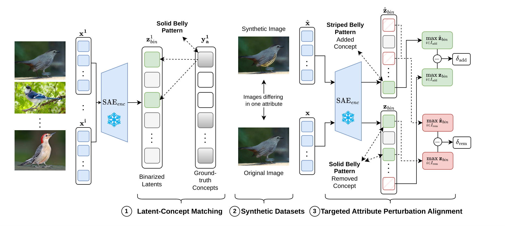

# Evaluating the Interpretability of Sparse Autoencoders with Concept Annotations: Official Implementation

[](https://arxiv.org/abs/2606.24716)
[](https://jonasklotz.com/sae-metric/)
[](https://huggingface.co/datasets/jokl/syncub)
[](https://huggingface.co/datasets/jokl/syncoco)

This repository is the official implementation of **"Evaluating the
Interpretability of Sparse Autoencoders with Concept Annotations"** — Jonas
Klotz, Cassio Fraga Dantas, Pallavi Jain, Diego Marcos, Begüm Demir @ *ECCV
2026*.

## Abstract / Description

We evaluate how well sparse autoencoders (SAEs) trained on vision-model
embeddings recover human-interpretable concepts, using datasets with per-image
concept annotations as ground truth. The repository implements the training,
matching, and functional-validation pipeline behind the paper's results.

## Contributions

- **FBMP (Fully-Binary Matching Pursuit)** — many-to-one greedy coalition
matching of SAE latents to annotated attributes, operating entirely in the
binary domain (OR reconstruction, AND+NOT residuals, Fβ selection).
- **MATCHScore / ΔMATCHScore** — average F1 between a matched latent coalition
and the ground-truth attribute, with a random-SAE baseline correction for
dictionary-size inflation.
- **TAPAScore** — Targeted Attribute Perturbation Alignment Score; a functional
check that matched latents respond selectively and in the correct direction on
paired images differing in a single attribute.
- **synCUB / synCOCO** — synthetic paired-image benchmarks where each pair
differs in exactly one attribute.

[](images/full_method.png)

## Setup

The project uses [`uv`](https://github.com/astral-sh/uv) and targets Python 3.12.

```
uv sync
source .venv/bin/activate
```

## Datasets

The matching benchmarks use:

- **CUB** — 312 binary attributes per image.
- **COCO** — multi-label object categories.

Point the dataset configs (`config/dataset/{cub,coco}.yaml`) at your local copies
of the data. Outputs (embeddings, trained SAEs, metrics, visualizations) are
written under the `outputs` root configured in `config/paths.yaml`.

### Base CUB / COCO

Download the source datasets from their official providers:

- **CUB-200-2011** — <https://www.vision.caltech.edu/datasets/cub_200_2011/>
- **MS-COCO** — <https://cocodataset.org/#download>

### Synthetic paired benchmarks (synCUB / synCOCO)

The synthetic paired-image benchmarks are released on the Hugging Face Hub:

- [](https://huggingface.co/datasets/jokl/syncub) — <https://huggingface.co/datasets/jokl/syncub>
- [](https://huggingface.co/datasets/jokl/syncoco) — <https://huggingface.co/datasets/jokl/syncoco> (`v1.0`, and latest `v2.0`)

Each repo ships `images/`, a `metadata.csv`, and a self-contained PyTorch `Dataset` loader. Download a specific version and load it:

```
# CLI download (whole repo at a tagged version)
hf download jokl/syncub  --repo-type dataset --revision v1.0 --local-dir data/syncub
hf download jokl/syncoco --repo-type dataset --revision v2.0 --local-dir data/syncoco
```

```
# or from Python, then load with the shipped loader
from huggingface_hub import snapshot_download
root = snapshot_download("jokl/syncub", repo_type="dataset", revision="v1.0")

from syncub_dataset import SynCUBDataset            # shipped inside the repo
ds = SynCUBDataset(root)
```

The exported datasets can also be (re)built from local source data with the
scripts under `src/scripts/hf_export/` (`export_syncub_hf.py`, `export_syncoco_hf.py`).

## Usage

The pipeline is driven by Hydra through `src/main.py`. Stages are toggled by
(un)commenting them in `main()`.

```
# 1. Embed images (standalone script)
python src/scripts/calculate_embeddings_for_images.py dataset=cub model=clip

# 2. Train an SAE
python src/main.py dataset=cub model=clip sae=topk sae.dict_size=256

# 3. Compute matching + perturbation metrics
python src/main.py dataset=cub model=clip sae=topk sae.dict_size=256
```

**Models:** `clip` (ViT-L-14, primary), `dinov2` (ViT-S-14). **SAE variants:** `topk`, `batchtopk`, `matryoshka`, `jumprelu`, plus `random` and `frozen` baselines.

Portable launchers for the full experiments live in `run_scripts/` (plain bash
loops, no SLURM — wrap the inner `python` call in `srun`/`sbatch` to run on a
cluster):

- `run_main_experiments.sh` — full sweep (embed → train → all metrics) over
datasets × models × SAE variants × dictionary sizes.
- `run_probe_metrics.sh` — linear-probe upper bound (not part of `main.py`).
- `run_classifier.sh` — synCUB / synCOCO synthetic-data sanity classifier.

## Repository structure

```
config/        Hydra configs (datasets, models, SAE variants, paths)
src/
  main.py            Entry point — toggle pipeline stages
  datamodule/        CUB / COCO data + synthetic paired datasets
  models/            Lightning SAE training module
  overcomplete/      Vendored SAE library (TopK, BatchTopK, Matryoshka, JumpReLU, ...)
  metrics/           GT matching (F1, FBMP, nnomp), TAPAScore, baselines (FMS, MS, CKNNA)
  visualization/     Concept / latent visualizations
  scripts/           Embedding, classifier, and figure-generation scripts
run_scripts/   Portable shell launchers for the paper's experiments
```

## Links

- **Paper (arXiv):** <https://arxiv.org/abs/2606.24716>
- **Project page:** <https://jonasklotz.com/sae-metric/>
- **synCUB dataset:** <https://huggingface.co/datasets/jokl/syncub>
- **synCOCO dataset:** <https://huggingface.co/datasets/jokl/syncoco>

## Citation

```
@inproceedings{klotz2026evaluating,
  title     = {Evaluating the Interpretability of Sparse Autoencoders with Concept Annotations},
  author    = {Jonas Klotz and Cassio Fraga Dantas and Pallavi Jain and Diego Marcos and Beg\"{u}m Demir},
  booktitle = {European Conference on Computer Vision (ECCV)},
  year      = {2026}
}
```
